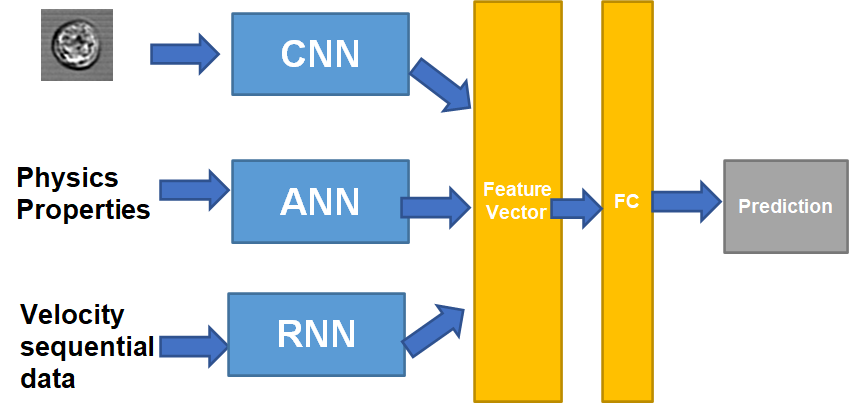

# Plans and Timeline

## Overall workflow

We plan to build up a multi-input model featured to handle various type of data. 

The information collected during the experiment includes three different types of data representation: image information (multi-modals image matrix), physical properties such as deformation and impedance (numeric information), and velocity profile(sequential data). 

We need to build-up:

- A CNN model for handling static cell image
- A traditional MLP model to encode physics properties in the form of numeric data
- An RNN encoder to project the sequential data to a feature vector

## Sub-tasks to finish

### Data collection

We already have a pre-written code ready for collecting image and velocity data out of cell video. The scripts are not in the perfect shape but can work in properly to handle the cell video. Current it works based on the demo version of video and background. We need to make the scripts better with better documentation and style, and let it accommodate the actual video files. We also need to let the code generate the preferred return: image data at various location and the velocity profile as a sequential data.

 ### CNN model -- Image data

We can start by using pre-trained network and transfer learning the image file. We can build up a multi-modal image classifier by learning cell images at different locations.

 ### RNN model -- Sequential data

The velocity data should be encoded to a feature vector. We can specify a fixed size of the velocity data and let it fit a RNN encoder with generating velocity feature vector. The model does not have to be RNN. Modern technique such as transformer, attentional mechanism can also be a choice.

### Multi-dimension input

Feature from different data sources can be concatenated together right before the feature FC layer. We set one-layer NN to learn the optimized weight of  importance of each specific feature.

## Plan

- Daolong:

|            | Sub-task     | Details and Expected outcome                                 |
| ---------- | ------------ | ------------------------------------------------------------ |
| Week 1     | Data collect | Polish the code to make it a good O-O style of code with cell image at different location returned |
| Week 2 - 3 | Data collect | Implement the collection code with raw, fast, video data     |
| Week 4     | Image        | Prepare raining experiments for CNN model and conduct image-category training experiments |

- Muyuan:

|            | Sub-task    | Details and Expected outcome                                 |
| ---------- | ----------- | ------------------------------------------------------------ |
| Week 1     | Multi-input | Locate a good example and try finishing similar experiments with various input data representations |
| Week 2 - 3 | Multi-input | According to other's work, build up our own multi-dimension model with managing images and sequential data |
| Week 4     | Velocity    | Prepare training experiments for RNN model and conduct velocity-category training experiments |

